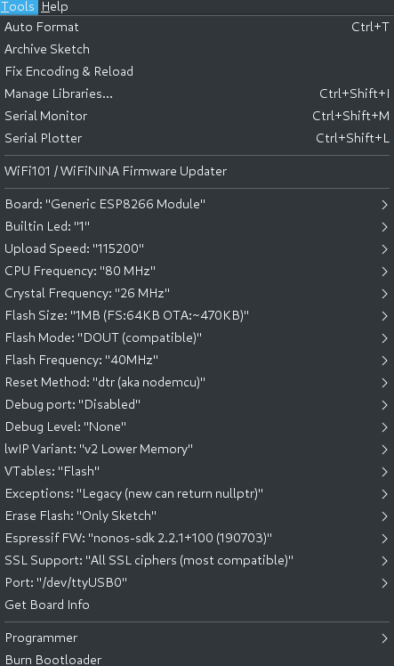

# ESP-01 Programmer

## Schematic:

The RESET function/pin is not working in any of my breakout
boards. According to the
[Datasheet](https://www.espressif.com/sites/default/files/documentation/0a-esp8266ex_datasheet_en.pdf)
the RESET pin is active low, but it is not working on my breakout
boards. The workaround I found is to power-cycle the board every time
a reset is needed (including programming).

## Board library for Arduino IDE (1.8.13) programming

[esp8266/Arduino](https://github.com/esp8266/Arduino)
## Programming
Set the board parameters according to this picture:

Short the jumnper (JP1), hit "upload" then power-cycle the board. The
upload should run smoothly. If it does not, activate verbose output
for upload, then when you see this line:

`Connecting........_____`

Power-cycle the board again.

## Files

* [Schematic (PDF)](ESP01-Programmer.pdf)
* [3D board view](ESP01-Programmer_3D.png) - That is just a reference
  to help assembling on a prefboard
* [Kicad files](Kicad)

